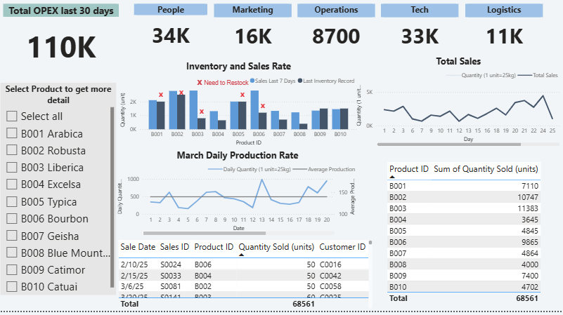

# CBR Production Monitoring Dashboard (CARE)

## Project Overview
This project is a **Business Intelligence case study** based on a fictional coffee production company (CBR).  
The goal was to design a **production monitoring dashboard** that provides executives with real-time visibility into production performance, inventory levels, and operational trends across multiple locations.

The dashboard supports decision-making for operations leadership who cannot be physically present at all production sites.

---

## Business Objectives
- Monitor **daily production output** with rolling 30-day visibility  
- Compare **month-over-month production trends**
- Track **inventory levels and sales velocity** to avoid overstocking
- Provide executives with **high-level KPIs** for operational oversight

---

## Data Sources
- **Production logs ( [Excel](power bi/data/production_logs.xlsx))**  
  - Manually recorded by production employees after each batch
  - Stored and maintained in Microsoft 365 (simulated)
- **Sales data**  
  - Assumed to be generated automatically by an eCommerce system (conceptual)

> For this case study, production data was generated and structured in Excel to simulate real operational inputs.

---

## Tools & Technologies
- **Microsoft Excel** – Data generation, cleaning, and structuring  
- **Power BI** – Data modeling, DAX measures, and dashboard visualization  

---

## Dashboard Features
- Daily production volume tracking  
- 30-day rolling production view  
- Month-over-month trend analysis  
- Inventory and sales rate indicators  
- Executive-level KPI summary

---

## Dashboard Preview

---

## Repository Structure
- data/ → Excel production datasets
- dashboard/ → Power BI file and screenshots
- docs/ → Case reference and documentation

---

## Key Skills Demonstrated
- Business requirements interpretation  
- KPI definition and operational metrics design  
- Data modeling and visualization  
- Translating business problems into BI solutions  

---

## Notes
- This project is based on an academic case study.
- Data has been **simulated and anonymized** for portfolio use.
- Power BI `.pbix` file is included for reference; screenshots are provided for quick review.

---

## Author
**Julie Jang**  
Business Analysis & Data Analytics  
